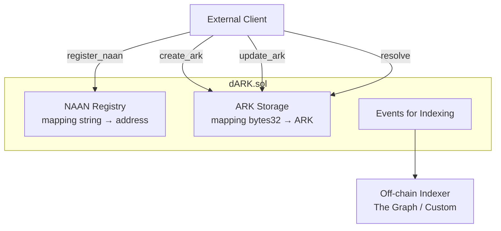

# dARK 2.0 - Minimal Decentralized ARK Registry

## Overview

**dARK 2.0** is a minimal smart contract for managing [ARK (Archival Resource Key)](https://arks.org/) identifiers on blockchain. It provides a decentralized registry where NAAN owners can create and manage persistent identifiers.

## Architecture



## Data Structures

### ARK Struct
```solidity
struct ARK {
    string url;         // Resolution URL
    string cid;         // IPFS CID for metadata
    address owner;      // Owner (NAAN owner at creation time)
    uint256 created_at; // Creation timestamp
    uint256 updated_at; // Last update timestamp
}
```

### Storage
- `naan_owners`: mapping(string => address) - NAAN to owner wallet
- `_arks`: mapping(bytes32 => ARK) - ARK hash to ARK data

---

## API Reference

### NAAN Management

#### `register_naan(string naan)`
Register a new NAAN for the caller's wallet.

```solidity
// Example: Register NAAN "12345"
contract.register_naan("12345");
```

**Requirements:**
- NAAN must not be empty
- NAAN must not be already registered

**Events:** `NAANRegistered(naan, owner)`

---

#### `transfer_naan(string naan, address new_owner)`
Transfer NAAN ownership to another wallet.

```solidity
// Transfer NAAN to another address
contract.transfer_naan("12345", 0x123...);
```

**Requirements:**
- Caller must be current NAAN owner
- New owner cannot be zero address

**Events:** `NAANTransferred(naan, from, to)`

---

### ARK Management

#### `create_ark(string ark_id, string url, string cid)`
Create a new ARK identifier.

```solidity
// Create a new ARK
contract.create_ark(
    "ark:/12345/abc123",
    "https://example.com/resource",
    "QmXyz..."
);
```

**ARK ID Format:** `ark:/NAAN/name`
- Must start with `ark:/`
- NAAN must be registered to caller

**Requirements:**
- ARK must not already exist
- Caller must own the NAAN in the ARK ID

**Events:** `ARKCreated(ark_id, owner, url, cid)`

---

#### `update_ark(string ark_id, string url, string cid)`
Update URL and/or CID of an existing ARK.

```solidity
// Update an existing ARK
contract.update_ark(
    "ark:/12345/abc123",
    "https://new-url.com/resource",
    "QmNewCid..."
);
```

**Requirements:**
- ARK must exist
- Caller must be ARK owner

**Events:** `ARKUpdated(ark_id, url, cid)`

---

### View Functions

#### `resolve(string ark_id) → string url`
Resolve an ARK to its URL.

```solidity
string memory url = contract.resolve("ark:/12345/abc123");
// Returns: "https://example.com/resource"
```

---

#### `get_ark(string ark_id) → ARK`
Get full ARK data.

```solidity
ARK memory ark = contract.get_ark("ark:/12345/abc123");
// Returns: { url, cid, owner, created_at, updated_at }
```

---

#### `ark_exists(string ark_id) → bool`
Check if an ARK exists.

```solidity
bool exists = contract.ark_exists("ark:/12345/abc123");
```

---

#### `naan_exists(string naan) → bool`
Check if a NAAN is registered.

```solidity
bool exists = contract.naan_exists("12345");
```

---

#### `naan_owners(string naan) → address`
Get the owner of a NAAN (public mapping).

```solidity
address owner = contract.naan_owners("12345");
```

---

## Events

| Event | Parameters | Description |
|-------|------------|-------------|
| `NAANRegistered` | `naan`, `owner` | New NAAN registered |
| `NAANTransferred` | `naan`, `from`, `to` | NAAN ownership transferred |
| `ARKCreated` | `ark_id`, `owner`, `url`, `cid` | New ARK created |
| `ARKUpdated` | `ark_id`, `url`, `cid` | ARK updated |

### Indexing Events (JavaScript Example)

```javascript
// List all ARKs by reading events
const events = await contract.queryFilter("ARKCreated");
const allArks = events.map(e => ({
    ark_id: e.args.ark_id,
    owner: e.args.owner,
    url: e.args.url,
    cid: e.args.cid
}));
```

---

## Usage Examples

### 1. Register a NAAN and Create ARKs

```javascript
// 1. Register your NAAN
await contract.register_naan("12345");

// 2. Create ARKs with your NAAN
await contract.create_ark(
    "ark:/12345/resource1",
    "https://example.com/resource1",
    "QmCid1..."
);

await contract.create_ark(
    "ark:/12345/resource2", 
    "https://example.com/resource2",
    "QmCid2..."
);
```

### 2. Resolve an ARK

```javascript
const url = await contract.resolve("ark:/12345/resource1");
console.log(url); // "https://example.com/resource1"
```

### 3. Update an ARK

```javascript
await contract.update_ark(
    "ark:/12345/resource1",
    "https://new-location.com/resource1",
    "QmNewCid..."
);
```

### 4. Transfer NAAN Ownership

```javascript
// Transfer NAAN to new owner (all existing ARKs remain under original owners)
await contract.transfer_naan("12345", "0xNewOwnerAddress...");
```

---

## Security Considerations

### Ownership Model
- **NAAN owners** can create new ARKs under their NAAN
- **ARK owners** can update their specific ARKs
- Transferring a NAAN does NOT transfer ownership of existing ARKs

### Validation
- ARK IDs must follow format: `ark:/NAAN/name`
- NAAN in ARK ID must match caller's registered NAAN
- Duplicate ARKs are rejected

---

## Gas Estimates

| Operation | Estimated Gas |
|-----------|---------------|
| `register_naan` | ~45,000 |
| `create_ark` | ~80,000 |
| `update_ark` | ~35,000 |
| `resolve` | ~3,000 (view) |
| `get_ark` | ~5,000 (view) |

---

## File Structure

```
dARK_dapp/
├── dARK.sol          # Main contract (~200 lines)
├── dark2.0_dapp.md   # This documentation
└── dark1.0_dapp.md   # Legacy v1.0 documentation (reference)
```

---

## Comparison with v1.0

| Aspect | v1.0 | v2.0 |
|--------|------|------|
| Files | 15 | **1** |
| Lines of code | ~2,500 | **~200** |
| Structs | 6 | **1** |
| On-chain ID generation | Yes (NOID) | **No (external)** |
| Payloads | Yes | **No (use IPFS CID)** |
| External PIDs | Yes | **No** |
| Gas per create | ~200k | **~80k** |
